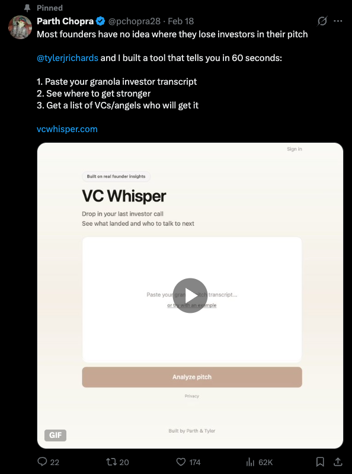
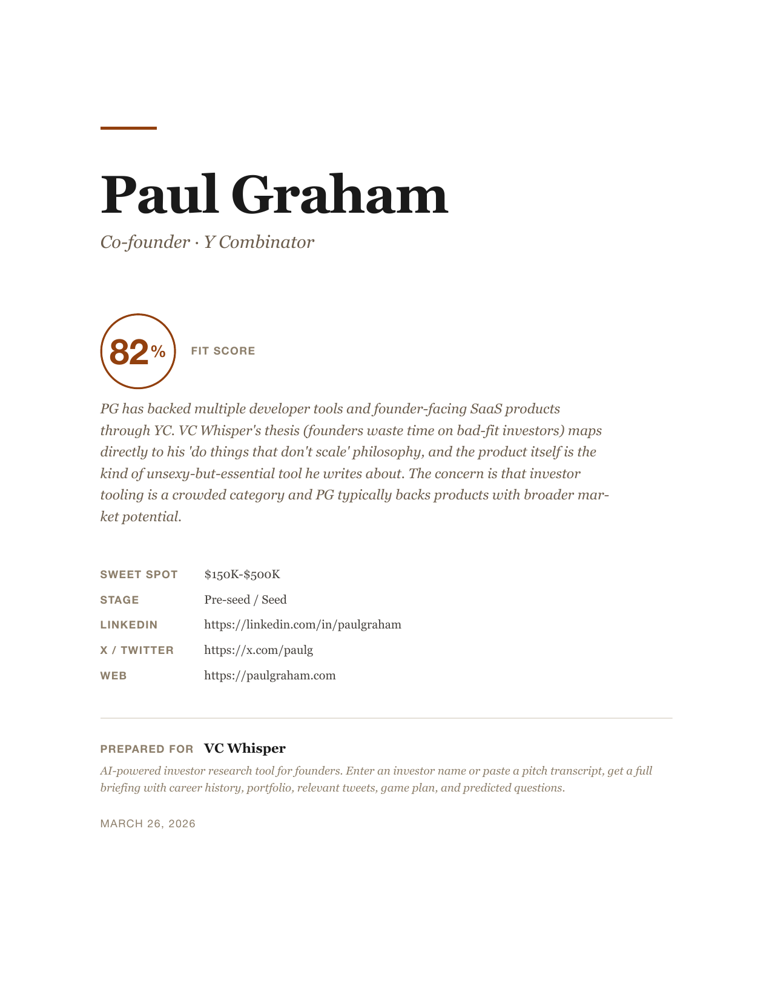

# VC Whisper Prepare

**Know your investor before you walk in.**

By [Parth Chopra](https://x.com/pchopra28) and [Tyler Richards](https://x.com/tylerjrichards). 62K founders watched [VC Whisper](https://vcwhisper.com) launch:

[](https://x.com/pchopra28/status/2024183884221444349)

Then they built [Prepare](https://vcwhisper.com/prepare), the pre-meeting investor briefing tool. This is that, as a [Claude Code skill](https://code.claude.com/docs/en/skills). Same depth, but it reads your pitch deck off disk, searches your email, checks your calendar, and generates a typeset PDF.

## Install

```bash
claude skill add cruhl/vc-prepare
```

Or: `git clone https://github.com/cruhl/vc-prepare.git ~/.claude/skills/vc-prepare`

## Run

```
/vc-prepare Paul Graham
```

The skill asks about your company to tailor the briefing (stage, traction, moat, prior contact). Answer what you want, or say "go" to skip.

```
/vc-prepare example
```

Runs a built-in demo: VC Whisper pitching itself to Paul Graham using VC Whisper Prepare.

## What You Get

-  **Fit Score.** Thesis alignment, portfolio pattern, stage fit, check size. Honest.
-  **Know Your Investor.** Career path, 6-10 portfolio companies, press, podcasts.
-  **Relevant to Your Pitch.** Their tweets and writing matched to your company.
-  **Your Game Plan.** How they think. Where you connect. Questions they'll ask (with answers). Things not to say.
-  **Other Investors.** 3-4 similar investors with fit scores and outreach angles.
-  **Quick Reference Card.** Eight lines for your second monitor during the Zoom.

##  PDF

[](examples/paul-graham.pdf)

Cormorant Garamond headings. Source Serif body. Cover page. Proper page breaks. [See the full PDF.](examples/paul-graham.pdf) Also available: [CLI output](examples/paul-graham.md) · [Raw JSON](examples/paul-graham.json)

## The Interview

Before researching, the skill asks a few targeted questions to sharpen the briefing:

1. What does your company do?
2. Company website?
3. Stage and raise amount?

Then 1-2 follow-ups from: traction metrics, moat/unfair advantage, biggest investor objection, prior contact with this investor. It skips anything already in the conversation or your pitch deck.

## API Keys (Optional)

Works immediately with Claude's built-in web search. Add keys for deeper data:

| Variable | Service | Adds |
|----------|---------|------|
| `EXA_API_KEY` | [Exa](https://exa.ai) | Neural search, LinkedIn enrichment |
| `XAI_API_KEY` | [xAI](https://x.ai) | Tweet discovery via Grok |
| `BROWSERBASE_API_KEY` | [Browserbase](https://browserbase.com) | Headless browser for blocked pages |

[Seedlist](https://seedlist.com) data is used automatically (free, no key needed).

## Why a Skill

A web app can't read your pitch deck, search your email, check your calendar, or generate a real PDF. This can.

- **Pitch deck off disk.** No upload, no DocSend passcode.
- **Email context.** Prior threads, warm intros, commitments.
- **Calendar context.** Other attendees, first call vs. follow-up.
- **Typeset PDF.** Serif fonts, cover page, page breaks.
- **Post-meeting.** Follow-up email drafts, calendar events, action items.

## Examples

Generated by running the skill:

```bash
./generate-examples.sh                    # All defaults
./generate-examples.sh "Marc Andreessen"  # Specific investor
```

## License

MIT
